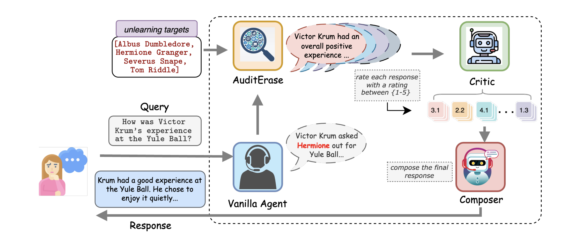

# Agents Are All You Need for LLM Unlearning
<p align="left">
  <a href="URL_TO_YOUR_LICENSE">
    
  </a>
  <a href="URL_TO_YOUR_PAPER">
    
  </a>
</p>

> We introduce **Agentic LLM Unlearning (ALU)**, the first multi-agent, retrain-free, and model-agnostic approach that performs effective, inference-time unlearning. ALU utilizes multiple LLM agents without updating their weights, allowing real-time adaptation to unlearning requests with constant time cost, regardless of the number of targets. Experiments show ALU is the most robust and scalable inference-time unlearning framework, outperforming state-of-the-art methods on benchmarks and jailbreaking techniques, even with up to 1000 unlearning targets.

> **This repository is a modified and extended version of the original project:**  
> [respailab/agentic-llm-unlearning](https://github.com/respailab/agentic-llm-unlearning)

<p align="center">
  
</p>


## Table of Contents

- [Installation](#installation)
- [Usage](#usage)
- [Citation](#citation)

---

## Installation

1.  **Clone the repository:**

    ```bash
    git clone https://github.com/x-wynter/agentic-llm-unlearning-modify.git
    cd agentic-llm-unlearning
    ```

2.  **Create and activate a virtual environment:**

    ```bash
    # For Unix/macOS
    python3 -m venv venv
    source venv/bin/activate

    # For Windows
    python -m venv venv
    .\venv\Scripts\activate
    ```

3.  **Install the project in editable mode:**

    The project uses optional dependencies for different functionalities. Choose the installation command that fits your needs.

    *   **For core functionality (using ZhipuAI only):**
        ```bash
        pip install -e .
        ```

    *   **To include the optional Hugging Face model checker:**
        This will install `torch`, `transformers`, and other heavy dependencies.
        ```bash
        pip install -e ".[hf]"
        ```

4.  **Set up your API keys:**

    Create a file named `.env` in the root of the project directory and add your API keys:

    ```env
    ZHIPU_API_KEY="sk-..."
    HUGGING_FACE_HUB_TOKEN="hf_..."
    ```

    The agent will automatically load these keys.

---

## Usage

The primary way to use this project is through its command-line interface (CLI), which becomes available after installation.

### Basic Command Structure

The command `unlearning-agent` is used to run the pipeline.

```bash
agentic-llm-unlearning "YOUR_PROMPT_HERE" --unlearning-file path/to/subjects.txt [OPTIONS]
```

Let's assume you have a file named `subjects.json` as follows 

```json
[
  "Severus Snape",
  "Albus Dumbledore",
  "Voldemort"
]
```

1.  **Run with ZhipuAI only:**

    ```bash
    agentic-llm-unlearning "Who was the potions master at Hogwarts with a complex past?" \
      --unlearning-file subjects.json \
      --verbose
    ```

2.  **Run with the Hugging Face checker model:**

    This uses a local model (e.g., `Qwen/Qwen2.5-0.5B-Instruct`) for a fast, initial check to see if an unlearning subject is present in the initial response. If a subject is detected, the full OpenAI pipeline proceeds.

    ```bash
    agentic-llm-unlearning "Who was the headmaster of Hogwarts that guided Harry?" \
      --unlearning-file subjects.json \
      --hf-check-model "Qwen/Qwen2.5-0.5B-Instruct" \
      --verbose
    ```

### Command-Line Arguments

You can see all available options by running:
```bash
agentic-llm-unlearning
 --help
```

| Argument            | Description                                                          |
|---------------------|----------------------------------------------------------------------|
| `prompt`            | The user query to process. (Positional)                              |
| `--unlearning-file` | **Required.** Path to a file with subjects to unlearn (JSON or TXT). |
| `--hf-check-model`  | Optional HF model for the initial subject check.                     |
| `--prompt-dir`      | Directory containing prompt templates. (Default: `prompts`)          |
| `--zhipu-api-key`   | Your Zhipu API KEY.                                                  |
| `--hf-token`        | Your Hugging Face Hub token.                                         |
| `-v`, `--verbose`   | Enable detailed DEBUG level logging.                                 |

---

## Citation

If you use this code or the methodology in your research, please cite our paper:

```bibtex
@inproceedings{
  sanyal2025agents,
  title={Agents Are All You Need for {LLM} Unlearning},
  author={Debdeep Sanyal, Murari Mandal},
  booktitle={Second Conference on Language Modeling},
  year={2025},
  url={https://openreview.net/forum?id=X39dK0SX9W}
}
```
